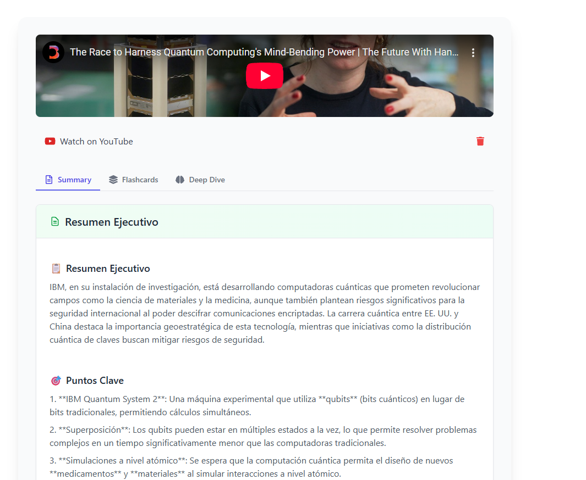
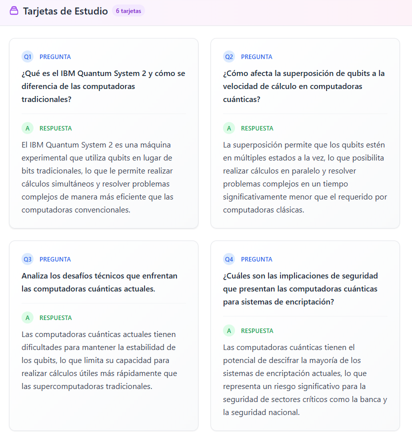
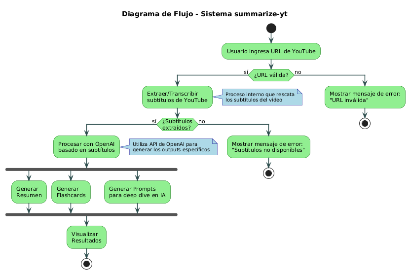

# SummarizeYT

> Transform YouTube videos into intelligent summaries and study materials with AI

A powerful web application that leverages AI to generate concise summaries and flashcards from YouTube videos. Built with React, TypeScript, Node.js, and OpenAI.

[](https://qdwbk6bg-5173.brs.devtunnels.ms/)
[](LICENSE)
[](https://reactjs.org/)
[](https://www.typescriptlang.org/)
[](https://nodejs.org/)

##  Screenshots 
### Interface 
 

### Functionality 



### FlowChart


## Features

- **Smart Video Processing** - Extract subtitles from any YouTube video
- **AI-Powered Summaries** - Generate concise summaries using OpenAI GPT-4
- **Flashcard Generation** - Create study flashcards from video content  
- **High Performance** - 10x faster than Puppeteer-based solutions
- **Responsive Design** - Perfect experience on desktop and mobile
- **Modern UI** - Clean interface with Tailwind CSS
- **Real-time Processing** - Live updates during video analysis

## Technologies Used

- **Frontend:**
    - React 18
    - TypeScript
    - TailwindCSS
    - Vite

- **Backend:**
    - Express.js
    - Node.js
    - HTTP-based subtitle extraction (no Puppeteer)

- **AI Integration:**
    - Azure OpenAI Services
    - GPT-4 for summarization and flashcard generation

- **Subtitle Extraction:**
    - DownSub.com integration
    - HTTP requests (no browser automation)
    - MCP browser support for complex cases

##  Setup and Installation

1. **Clone the repository:**
```bash
git clone https://github.com/javiermedinaj/yt-summarizer.git
cd yt-summarizer
```

2. **Install dependencies:**
```bash
# Backend
cd back
npm install

# Frontend
cd ../front
npm install
```

3. **Configure environment variables:**
```bash
# Backend
cd back
cp .env.example .env
# Edit .env with your Azure OpenAI credentials or using openai
```

4. **Start the application:**
```bash
# Backend (Terminal 1)
cd back
npm run dev

# Frontend (Terminal 2)
cd front
npm run dev
```


##  Performance Improvements

### Before (Puppeteer-based):
- ❌ High memory usage (Chrome browser)
- ❌ Slow performance (~5-10 seconds)
- ❌ Complex deployment requirements
- ❌ System dependencies

### After (HTTP-based):
- ✅ 10x faster performance (~500ms)
- ✅ Low memory usage
- ✅ Simple deployment
- ✅ No system dependencies
- ✅ Container-friendly


## API Endpoints

- `POST /api/video/extract-summary` - Extract and summarize video
- `POST /api/video/extract-summary-mcp` - MCP browser version
- `POST /api/flashcards/generate` - Generate flashcards from text

## Production Considerations

- **Rate Limiting**: Implement rate limiting to prevent abuse
- **Caching**: Cache subtitles for popular videos
- **Monitoring**: Add logging for success/failure tracking
- **User-Agent Rotation**: Rotate User-Agents to avoid detection


